# 1-1. V8 엔진 심층 분석: 바이트코드 컴파일과 인라인 캐싱

Node.js로 작성한 서버가 초당 수만 건의 요청을 처리할 수 있는 이유는 무엇일까? 싱글 스레드임에도 불구하고 어떻게 그토록 빠른 성능을 낼 수 있는 것일까? 그 답의 상당 부분은 V8 엔진에 있다. V8은 구글이 개발한 고성능 자바스크립트 엔진으로, Node.js의 심장부 역할을 담당한다. 자바스크립트 코드를 기계가 이해할 수 있는 형태로 변환하고, 실행 중에 지속적으로 최적화를 수행하여 놀라운 속도를 이끌어낸다.

많은 Node.js 개발자들이 V8의 존재는 알지만, 실제로 어떻게 동작하는지는 잘 모르는 경우가 많다. "자바스크립트는 인터프리터 언어니까 느리다"라는 오래된 인식도 여전히 존재한다. 하지만 현대의 V8은 단순한 인터프리터가 아니다. 정교한 JIT(Just-In-Time) 컴파일러와 다양한 최적화 기법을 통해 C++로 작성된 코드에 근접하는 성능을 달성하기도 한다. V8이 어떻게 동작하는지 이해하면, 왜 특정 코드 패턴이 빠르고 다른 패턴이 느린지를 근본적인 수준에서 파악할 수 있다. 이는 단순히 "이렇게 하면 빠르다"는 팁을 암기하는 것과는 차원이 다른 깊이의 이해를 제공한다.

이 장에서는 V8의 컴파일 파이프라인을 단계별로 살펴보고, 핵심 최적화 기법인 인라인 캐싱(Inline Caching)의 원리를 깊이 있게 탐구한다. 그리고 이러한 지식을 바탕으로 V8 친화적인 코드를 작성하는 실용적인 가이드라인을 제시한다.

## 1-1-1. V8 엔진이란 무엇인가

V8을 제대로 이해하기 위해서는 먼저 이 엔진이 왜 만들어졌고, 어떤 철학을 바탕으로 설계되었는지 알아야 한다. 자바스크립트 엔진의 역사를 살펴보면 V8이 얼마나 혁신적인 존재였는지, 그리고 왜 이토록 복잡한 최적화 기법들이 필요한지를 자연스럽게 이해할 수 있다.

### 1-1-1-1. V8의 탄생 배경

자바스크립트는 1995년 넷스케이프의 브렌던 아이크(Brendan Eich)가 단 10일 만에 설계한 언어다. 원래는 웹 페이지에 간단한 상호작용을 추가하기 위한 "장난감" 수준의 스크립팅 언어로 만들어졌다. 폼 검증이나 간단한 애니메이션 정도가 주된 용도였고, 성능은 크게 중요하지 않았다. 초기 자바스크립트 엔진들은 소스 코드를 한 줄씩 읽어서 바로 실행하는 단순한 인터프리터 방식으로 동작했다.

하지만 2000년대 중반에 접어들면서 상황이 급변했다. Gmail(2004년), Google Maps(2005년)와 같은 웹 애플리케이션이 등장하면서 자바스크립트의 역할이 완전히 달라졌다. 이제 자바스크립트는 수천, 수만 줄의 복잡한 로직을 처리해야 했고, 기존 엔진들의 성능은 턱없이 부족했다. 이러한 성능 이슈로 인해 Google Maps에서 지도를 드래그할 때마다 버벅거리는 경험은 당시 개발자들에게 익숙한 것이었다.

그러던 중 2008년 9월, 구글은 크롬 브라우저와 함께 V8 엔진을 공개했다. V8은 자바스크립트 엔진의 패러다임을 완전히 바꿔놓았다. 기존 엔진들이 인터프리터 방식에 머물러 있을 때, V8은 JIT(Just-In-Time) 컴파일이라는 혁신적인 접근 방식을 도입했다. 자바스크립트 코드를 실행 시점에 기계어로 직접 컴파일하여, 인터프리터의 오버헤드를 제거한 것이다.

### 1-1-1-2. 동적 타입 언어의 딜레마

V8 팀의 목표는 "the fastest JavaScript runtime on the planet"(세계에서 가장 빠른 자바스크립트 런타임)을 만드는 것이었다[^1]. 동적 타입의 느슨한 언어에서 이러한 목표를 달성하는 것은 대담한 도전이었다. 이것이 왜 어려운 목표인지 이해하려면 자바스크립트의 본질적인 특성을 알아야 한다. 프론트엔드 개발자라면 누구나 아는 것처럼 자바스크립트는 동적 타입 언어다. 변수의 타입이 실행 중에 바뀔 수 있고, 객체에 언제든 새로운 속성을 추가하거나 삭제할 수 있다. 다음 예제 코드를 살펴보자.

```javascript
let value = 42 // 숫자
value = 'hello' // 이제 문자열
value = { x: 1 } // 이제 객체

const obj = {}
obj.name = 'Alice' // 동적으로 속성 추가
delete obj.name // 속성 삭제도 가능
```

이러한 유연성은 개발자에게 엄청난 자유를 주지만, 엔진 입장에서는 최적화를 극도로 어렵게 만드는 요소다. C++이나 Java 같은 정적 타입 언어에서는 컴파일 시점에 모든 변수의 타입과 객체의 구조가 확정된다. 컴파일러는 이 정보를 활용하여 매우 효율적인 기계어 코드를 생성할 수 있다. 반면 자바스크립트 엔진은 `value`가 숫자인지, 문자열인지, 객체인지 실행해보기 전까지 알 수 없다. 매번 타입을 확인하고 적절한 연산을 선택해야 한다면 성능 저하는 불가피하다.

그렇다면 V8은 이 문제를 어떻게 해결했을까? 핵심 아이디어는 의외로 단순하다. **"미리 알 수 없다면, 실행하면서 배우자."** V8은 코드를 실행하면서 타입 정보를 수집하고, 이를 바탕으로 최적화된 코드를 생성한다. 이 전략을 구현하기 위해 V8은 여러 구성 요소로 이루어진 정교한 시스템을 갖추고 있다.

지금부터 Node.js의 V8 엔진에 숨겨진 비밀을 하나씩 파헤쳐 보자.

## 1-1-2. 자바스크립트 코드가 실행되기까지: 컴파일 파이프라인

자바스크립트 코드 한 줄이 실제로 CPU에서 실행되기까지는 여러 단계의 변환 과정을 거친다. V8의 컴파일 파이프라인을 이해하면 코드 최적화의 원리를 더 깊이 파악할 수 있다.

아래 다이어그램은 V8의 전체 컴파일 파이프라인을 보여준다. 소스 코드가 파서를 거쳐 AST가 되고, Ignition 인터프리터가 바이트코드를 실행하면서 타입 정보를 수집한다. 자주 실행되는 코드는 Maglev나 TurboFan에 의해 최적화된 기계어로 컴파일되며, 타입 가정이 깨지면 디옵티마이제이션을 통해 다시 바이트코드로 돌아간다.

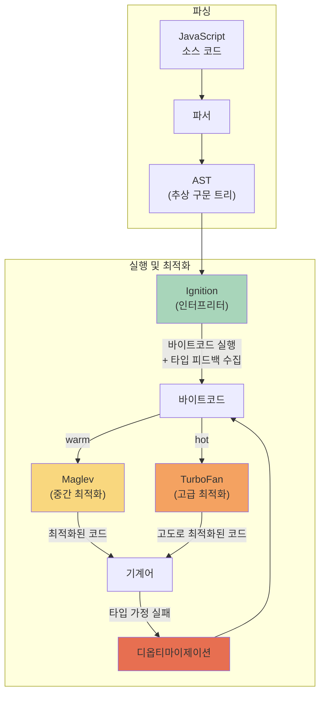

이제 각 단계를 하나씩 살펴보자.

### 1-1-2-1. 파싱과 AST 생성

모든 것은 파싱(Parsing)에서 시작된다. V8의 파서는 자바스크립트 소스 코드를 읽어 **추상 구문 트리(Abstract Syntax Tree, AST)** 를 생성한다. AST는 코드의 구조를 트리 형태로 표현한 것으로, 이후 모든 컴파일 과정의 기반이 된다.

다음 코드를 예로 들어보자.

```javascript
function add(a, b) {
  return a + b
}
```

이 코드는 파싱되어 대략 다음과 같은 구조의 AST로 변환된다.

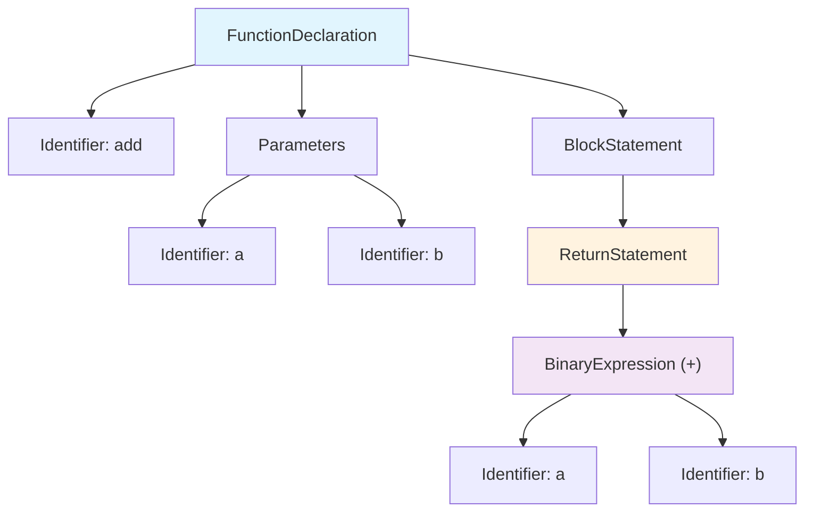

최상위에 FunctionDeclaration 노드가 있고, 그 아래에 함수명 `add`, 매개변수 `a`와 `b`, 그리고 함수 본문을 나타내는 BlockStatement가 있다. BlockStatement 안의 ReturnStatement 아래에는 BinaryExpression이 있어 `a + b` 연산을 표현한다. 이처럼 AST는 코드의 문법적 구조를 계층적으로 표현하여, 이후 컴파일러가 코드의 의미를 분석하고 변환하는 데 사용된다.

AST Explorer[^2]를 사용하면 실제 AST 구조를 직접 확인할 수 있다. 예를 들어 `const x = 1 + 2`라는 간단한 코드를 acorn 파서로 파싱하면 다음과 같은 JSON 구조가 생성된다.

```json
{
  "type": "Program",
  "body": [
    {
      "type": "VariableDeclaration",
      "declarations": [
        {
          "type": "VariableDeclarator",
          "id": { "type": "Identifier", "name": "x" },
          "init": {
            "type": "BinaryExpression",
            "left": { "type": "Literal", "value": 1 },
            "operator": "+",
            "right": { "type": "Literal", "value": 2 }
          }
        }
      ],
      "kind": "const"
    }
  ]
}
```

> V8 내부 파서는 acorn과 다르지만, 생성되는 AST의 개념적 구조는 유사하다. acorn은 ECMAScript 표준을 따르는 경량 파서로, Node.js 생태계에서 webpack, ESLint 등 다양한 도구의 기반이 된다.

V8의 파서는 **두 단계** 로 동작한다. 첫 번째는 **Pre-parser(사전 파서)** 로, 전체 코드를 빠르게 스캔하여 문법 오류를 검출하고 함수 경계를 파악한다. 두 번째는 **Full Parser(완전 파서)** 로, 실제로 실행될 코드에 대해 완전한 AST를 생성한다.

V8은 파싱 비용을 줄이기 위해 **지연 파싱(Lazy Parsing)** 기법을 사용한다[^3]. 모든 함수를 처음부터 완전히 파싱하지 않고, 함수 선언만 기록해두었다가 실제로 호출될 때 완전한 파싱을 수행한다. 예를 들어 다음과 같은 코드가 있다고 하자.

```javascript
function heavyComputation() {
  // 수백 줄의 복잡한 로직...
}

function init() {
  console.log('앱 시작')
}

init() // init만 호출됨
```

이 경우 V8은 `heavyComputation` 함수의 본문을 완전히 파싱하지 않는다. 함수가 존재한다는 것만 기록해두고, 실제로 호출될 때 비로소 완전한 파싱을 수행한다. 대규모 자바스크립트 번들에서 실제로 사용되지 않는 함수가 많을 수 있으므로, 이 전략은 초기 로딩 시간을 크게 단축한다.

단, 지연 파싱에도 비용이 있다. 함수가 나중에 호출되면 그때 다시 파싱해야 하므로, 자주 호출되는 함수라면 오히려 손해가 될 수 있다. V8은 이를 보완하기 위해 함수가 즉시 실행되는 패턴(IIFE 등)을 감지하여 지연 파싱을 건너뛰는 휴리스틱을 적용한다.

### 1-1-2-2. Ignition: 바이트코드 인터프리터

파싱이 완료되면 AST는 **Ignition** 인터프리터에 의해 바이트코드로 컴파일된다. 바이트코드는 기계어보다 추상화된 중간 표현으로, 플랫폼에 독립적이면서도 인터프리터가 빠르게 실행할 수 있도록 설계되었다.

V8 공식 블로그에 따르면, Ignition이 생성하는 바이트코드는 기존 baseline 컴파일러가 생성하던 기계어 코드 대비 25~50% 수준의 크기를 가진다[^4]. 이러한 크기 감소는 특히 메모리가 제한된 모바일 환경에서 중요하다. V8 팀은 Ignition 도입으로 크롬 탭당 약 5%의 메모리 사용량이 감소했다고 밝혔다.

다음은 위의 `add` 함수가 어떤 형태의 바이트코드로 변환되는지 보여주는 예시다(`examples/1-1/1-1-1-bytecode-example.js`).

```bash
node --print-bytecode --print-bytecode-filter=add examples/1-1/1-1-1-bytecode-example.js
```

```
[generated bytecode for function: add (0x... <SharedFunctionInfo add>)]
Bytecode length: 6
Parameter count 3
Register count 0
Frame size 0
         Ldar a1
         Add a0, [0]
         Return
```

위 바이트코드를 이해하려면 먼저 Ignition의 구조를 알아야 한다. Ignition은 **레지스터 머신** 아키텍처를 사용한다. 가상 머신에는 크게 두 가지 방식이 있다. 스택 기반 가상 머신(예: JVM)은 연산에 필요한 값을 스택에 push/pop하며 처리한다. 반면 레지스터 머신은 연산 결과를 레지스터라는 저장 공간에 직접 저장하고 참조한다. V8은 특히 **누산기(accumulator)** 라는 특수 레지스터를 활용한다. 누산기는 "현재 작업 중인 값"을 담아두는 공간이라고 생각하면 된다. 대부분의 바이트코드 명령어가 이 누산기를 암시적으로 사용하기 때문에 명령어마다 "어디에 저장할지"를 명시할 필요가 없어 바이트코드 크기가 줄어든다.

이제 위 바이트코드를 해석해보자. `Ldar a1`은 두 번째 인자(`b`)를 누산기에 로드한다. `Add a0, [0]`은 첫 번째 인자(`a`)와 누산기의 값(방금 로드한 `b`)을 더해 결과를 다시 누산기에 저장한다. 여기서 `[0]`은 피드백 벡터의 슬롯 인덱스로, 이 연산에서 관찰된 타입 정보가 기록되는 위치다(피드백 벡터는 뒤에서 자세히 다룬다). 마지막으로 `Return`은 누산기의 값을 반환한다.

Ignition은 바이트코드를 하나씩 읽어서(fetch) 해석하고(decode) 실행하는(execute) 과정을 반복한다. 각 바이트코드 명령어에는 그에 대응하는 실행 코드(핸들러)가 있어서, 인터프리터는 명령어를 읽을 때마다 해당 핸들러를 찾아 실행한다. 이 핸들러들 자체가 기계어로 최적화되어 있어 인터프리터치고는 상당히 빠르지만, 그래도 한계는 있다[^5].

인터프리터의 근본적인 문제는 **매 명령어마다 "다음에 뭘 실행할지" 찾아야 한다** 는 점이다. 컴파일된 기계어 코드는 CPU가 순차적으로 쭉 실행하면 되지만, 인터프리터는 바이트코드를 읽고 → 해석하고 → 핸들러를 찾고 → 실행하는 과정을 반복해야 한다. 이 오버헤드를 제거하려면 바이트코드 자체를 기계어로 컴파일해야 한다. 이것이 JIT 컴파일러가 필요한 이유다.

> **V8 내부 구현 살펴보기**
>
> Ignition의 실행 흐름을 좀 더 자세히 들여다보자[^6]. 함수가 호출되면 **InterpreterEntryTrampoline** 이라는 진입점 코드가 먼저 실행된다. 이름이 "Trampoline(트램펄린)"인 이유는 마치 트램펄린에서 튀어오르듯, 여기서 실제 바이트코드 실행으로 "점프"하기 때문이다. 이 코드는 함수 실행에 필요한 스택 프레임(지역 변수, 반환 주소 등을 저장하는 메모리 영역)을 설정한 뒤, 첫 번째 바이트코드의 핸들러로 점프한다.
>
> 그렇다면 각 바이트코드 핸들러는 어떻게 다음 핸들러를 찾을까? V8은 **디스패치 테이블** 이라는 배열을 유지한다. 이 테이블에는 각 바이트코드 종류(Ldar, Add, Return 등)에 해당하는 핸들러의 메모리 주소가 저장되어 있다. 핸들러는 자신의 작업을 마친 후 다음 바이트코드 값을 읽고, 그 값을 인덱스로 사용해 테이블에서 다음 핸들러 주소를 찾아 바로 점프한다.
>
> 여기서 중요한 점은 일반적인 함수 호출이 아니라 **꼬리 호출(tail call)** 방식으로 점프한다는 것이다. 일반 함수 호출은 "돌아올 주소"를 스택에 저장하지만, 꼬리 호출은 그렇지 않다. 어차피 핸들러가 할 일은 다음 핸들러로 넘기는 것뿐이므로 돌아올 필요가 없기 때문이다. 덕분에 바이트코드가 수천 개여도 스택이 계속 쌓이지 않는다. 이러한 방식을 **간접 스레디드 인터프리터(indirectly threaded interpreter)** 라고 부른다. "간접"이라는 이름은 바이트코드가 핸들러 주소를 직접 담고 있지 않고, 테이블을 통해 간접적으로 찾기 때문에 붙었다.

### 1-1-2-3. Maglev: 중간 계층 컴파일러

Chrome M117(2023년)부터 V8에는 Ignition과 TurboFan 사이에 **Maglev** 라는 새로운 컴파일러가 추가되었다[^7]. Maglev는 TurboFan보다 약 10배 빠르게 컴파일하면서도 Ignition보다 훨씬 빠른 코드를 생성한다.

Maglev가 필요한 이유는 TurboFan의 컴파일 비용 때문이다. TurboFan은 매우 고품질의 최적화 코드를 생성하지만, 컴파일 자체에 상당한 시간이 소요된다. 함수가 핫 상태가 되었을 때 바로 TurboFan을 적용하면, 컴파일이 완료되기 전까지 여전히 느린 인터프리터 코드가 실행된다. 이 "컴파일 지연" 시간 동안 성능이 저하되는 문제가 있다. Maglev는 빠르게 "충분히 좋은" 코드를 생성하여 이 간극을 메운다.

Maglev의 설계는 TurboFan과 다른 철학을 따른다. TurboFan이 복잡한 중간 표현을 사용하는 반면, Maglev는 더 단순한 구조를 사용하여 컴파일 속도를 높이는 대신 일부 최적화 기회를 의도적으로 포기한다[^7].

V8 팀의 벤치마크 결과에 따르면, Maglev 도입으로 JetStream 벤치마크에서 의미 있는 성능 향상이 있었고, Speedometer에서는 에너지 소비가 약 10% 감소했다[^7].

### 1-1-2-4. TurboFan: 최적화 컴파일러

Ignition이 코드를 실행하는 동안 V8은 각 함수의 실행 빈도와 타입 정보를 수집한다. 특정 함수가 충분히 자주 호출되어 "핫(hot)" 상태가 되면, **TurboFan** 최적화 컴파일러가 해당 함수를 고도로 최적화된 기계어 코드로 다시 컴파일한다.

TurboFan이 적용하는 주요 최적화 기법들을 살펴보자[^8].

**인라이닝(Inlining)** 은 가장 중요한 최적화 중 하나다. 자주 호출되는 작은 함수를 호출 지점에 직접 삽입하여 함수 호출 오버헤드를 제거한다. 더 중요한 것은, 인라이닝 후에 다른 최적화들이 더 넓은 범위에서 적용될 수 있다는 점이다.

```javascript
// 인라이닝 전
function square(x) {
  return x * x
}

function sumOfSquares(a, b) {
  return square(a) + square(b)
}

// TurboFan이 인라이닝 후 내부적으로 보는 형태
function sumOfSquares(a, b) {
  return a * a + b * b // 함수 호출 없음
}
```

인라이닝 전에는 `sumOfSquares`를 실행할 때마다 `square` 함수를 두 번 호출해야 한다. 함수 호출은 인자를 스택에 저장하고, 새로운 스택 프레임을 만들고, 반환 주소를 기록하고, 함수 실행 후 다시 돌아오는 과정을 거친다. 그러나 인라이닝 후에는 이 모든 과정이 사라지고 곱셈 두 번과 덧셈 한 번만 남아 더욱 간결해졌다.

인라이닝의 진정한 위력은 단순히 함수 호출 오버헤드를 제거하는 데 있지 않다. **인라이닝 후에 다른 최적화들이 연쇄적으로 적용될 수 있다는 점** 이 핵심이다. 다음 예시를 통해 이 과정을 자세히 살펴보자[^9].

```javascript
function add(x, y) {
  return x + y
}

function calculate() {
  return add(1, 2)
}
```

`calculate` 함수가 핫 상태가 되면 TurboFan은 다음과 같은 단계별 최적화를 수행한다.

**1단계: 인라이닝**

TurboFan은 먼저 `add` 함수를 `calculate` 함수 내부로 인라이닝한다.

```javascript
function calculate() {
  return 1 + 2 // add(1, 2)가 인라인됨
}
```

함수 호출이 사라지고, `add` 함수의 본문이 직접 삽입되었다. 여기서 중요한 점은 인자 `x`와 `y`가 각각 상수 `1`과 `2`로 대체되었다는 것이다.

**2단계: 상수 폴딩(Constant Folding)**

이제 TurboFan은 `1 + 2`라는 표현식을 발견한다. 두 피연산자가 모두 컴파일 타임에 알려진 상수이므로, 런타임에 덧셈을 수행할 필요가 없다. TurboFan은 이 계산을 컴파일 타임에 미리 수행한다.

```javascript
function calculate() {
  return 3 // 1 + 2가 컴파일 타임에 계산됨
}
```

최종적으로 생성되는 기계어 코드는 그저 상수 `3`을 반환하는 것뿐이다. 원래 코드에서는 함수 호출, 인자 전달, 스택 프레임 생성, 덧셈 연산 등이 필요했지만, 이 모든 것이 사라지고 단 하나의 상수 반환만 남았다.

이 예시에서 볼 수 있듯이, 인라이닝은 그 자체로도 성능을 개선하지만 더 중요한 역할은 **다른 최적화의 문을 열어주는 것** 이다. 인라이닝이 없었다면 TurboFan은 `add(1, 2)`가 어떤 값을 반환하는지 알 수 없었을 것이고, 상수 폴딩도 불가능했을 것이다.

**타입 특화(Type Specialization)** 는 수집된 타입 정보를 바탕으로 특정 타입에 최적화된 코드를 생성한다. 자바스크립트의 `+` 연산자는 숫자 덧셈, 문자열 연결, 객체 변환 등 여러 의미를 가질 수 있다. 하지만 피드백 벡터에서 "이 위치에서는 항상 정수만 관찰되었다"는 정보가 있다면, TurboFan은 정수 덧셈에 특화된 단 몇 개의 기계어 명령만 생성한다.

**이스케이프 분석(Escape Analysis)** 은 객체의 생명주기를 분석하여 할당을 최적화한다. 객체가 함수 외부로 "탈출"하지 않는다면, 힙 할당 대신 스택에 할당하거나 아예 객체 할당 자체를 제거할 수 있다.

```javascript
function calculateDistance(x1, y1, x2, y2) {
  const p1 = { x: x1, y: y1 } // 이 객체는 함수를 벗어나지 않음
  const p2 = { x: x2, y: y2 } // 이 객체도 마찬가지

  const dx = p2.x - p1.x
  const dy = p2.y - p1.y
  return Math.sqrt(dx * dx + dy * dy)
}
```

원래 코드에서는 `calculateDistance`를 호출할 때마다 `p1`, `p2` 두 개의 객체가 힙 메모리에 생성된다. 하지만 TurboFan이 분석해보니 이 객체들은 함수 안에서만 사용되고 반환되거나 외부로 전달되지 않는다. 그렇다면 굳이 객체를 만들 필요가 없다. TurboFan은 이 코드를 내부적으로 다음과 같이 변환한다.

```javascript
// TurboFan 최적화 후 (개념적 표현)
function calculateDistance(x1, y1, x2, y2) {
  // p1, p2 객체 생성 없이 인자를 직접 사용
  const dx = x2 - x1
  const dy = y2 - y1
  return Math.sqrt(dx * dx + dy * dy)
}
```

객체 할당이 사라졌다. `p1.x`는 그냥 `x1`이고, `p2.x`는 `x2`이므로 객체를 거칠 필요가 없는 것이다. 이렇게 하면 힙 메모리 할당 비용과 나중에 가비지 컬렉터가 이 객체들을 수거하는 비용이 모두 사라진다.

이스케이프 분석이 특히 효과적인 또 다른 사례는 **Rest Parameters** 다[^9]. ES6에서 도입된 Rest Parameters(`...args`)는 가변 인자를 배열로 수집하는 편리한 문법이다. 하지만 내부적으로는 매 호출마다 새로운 배열 객체가 힙에 할당되어야 한다.

```javascript
function max(...args) {
  let result = -Infinity
  for (const x of args) {
    if (x > result) result = x
  }
  return result
}

max(1, 2, 3)
```

이 코드에서 `...args`는 `[1, 2, 3]`이라는 배열을 생성한다. 배열이 힙에 할당되면 메모리 할당 비용이 발생하고, 나중에 가비지 컬렉터가 이 배열을 수거해야 한다. 함수가 자주 호출될수록 이 오버헤드가 누적된다.

TurboFan의 이스케이프 분석은 이 상황을 분석하여 최적화할 수 있다. `args` 배열이 함수 내부에서만 사용되고 외부로 전달되거나 반환되지 않는다는 것을 감지하면, **스칼라 대체(Scalar Replacement)** 라는 기법을 적용한다.

스칼라 대체란 객체나 배열 전체를 할당하는 대신, 그 내부의 개별 값들을 별도의 변수(또는 레지스터)로 분리하는 최적화다. 위 예시에서 TurboFan이 수행하는 최적화 과정을 단계별로 살펴보자.

**1단계: 이스케이프 분석**

TurboFan은 `args` 배열이 함수 외부로 탈출하는지 분석한다.

- `args`가 반환되는가? → 아니오 (`result`만 반환)
- `args`가 다른 함수에 전달되는가? → 아니오
- `args`가 외부 변수에 저장되는가? → 아니오

결론: `args`는 탈출하지 않는다.

**2단계: 스칼라 대체**

배열이 탈출하지 않으므로, TurboFan은 배열 할당을 제거하고 개별 요소를 직접 사용하도록 코드를 변환한다.

```javascript
// TurboFan 최적화 후 (개념적 표현)
function max(arg0, arg1, arg2) {
  let result = -Infinity
  // args[0], args[1], args[2] 대신 arg0, arg1, arg2 직접 사용
  if (arg0 > result) result = arg0
  if (arg1 > result) result = arg1
  if (arg2 > result) result = arg2
  return result
}
```

최적화 후에는 배열 객체가 전혀 생성되지 않는다. 힙 할당이 사라지고, 가비지 컬렉션 부담도 없다. 값들은 CPU 레지스터에서 직접 처리되어 메모리 접근 오버헤드도 최소화된다.

이처럼 이스케이프 분석과 스칼라 대체는 개발자가 편리하게 작성한 고수준 코드를, 마치 저수준에서 세심하게 최적화한 것처럼 변환해준다. Rest Parameters, 임시 객체, 구조 분해 할당 등 자바스크립트의 편의 기능들이 성능 저하 없이 사용될 수 있는 것은 이러한 최적화 덕분이다.

**루프 최적화** 는 반복문의 성능을 개선한다. 대표적인 기법으로 **루프 불변 코드 이동(Loop Invariant Code Motion)** 이 있다.

```javascript
// 최적화 전
for (let i = 0; i < arr.length; i++) {
  const factor = config.multiplier * 2 // 매 반복마다 같은 계산
  result += arr[i] * factor
}

// TurboFan 최적화 후 (개념적 표현)
const factor = config.multiplier * 2 // 루프 밖으로 이동
for (let i = 0; i < arr.length; i++) {
  result += arr[i] * factor
}
```

`config.multiplier * 2`는 루프가 몇 번 돌든 결과가 같다. 이런 계산을 루프 안에서 반복할 필요가 없으므로 TurboFan은 루프 밖으로 옮긴다.

**루프 언롤링(Loop Unrolling)** 은 루프 본문을 여러 번 복제하여 반복 횟수를 줄인다.

```javascript
// 최적화 전
for (let i = 0; i < 4; i++) {
  sum += arr[i]
}

// 루프 언롤링 후 (개념적 표현)
sum += arr[0]
sum += arr[1]
sum += arr[2]
sum += arr[3]
```

루프 언롤링이 왜 빠를까? 루프는 매 반복마다 "i를 증가시키고, 조건을 검사하고, 루프 시작으로 점프"하는 과정을 거친다. 루프를 풀어버리면 이 제어 오버헤드가 사라진다. 다만 코드 크기가 커지므로 TurboFan은 반복 횟수가 적고 효과가 클 때만 언롤링을 적용한다.

**범위 분석(Range Analysis)** 은 변수가 가질 수 있는 값의 범위를 추적하여 불필요한 검사를 제거한다.

```javascript
function sumArray(arr) {
  let sum = 0
  for (let i = 0; i < arr.length; i++) {
    sum += arr[i] // 배열 접근
  }
  return sum
}
```

자바스크립트에서 `arr[i]`로 배열에 접근할 때, 엔진은 원칙적으로 `i`가 유효한 범위(0 이상, 배열 길이 미만)인지 매번 검사해야 한다. 하지만 TurboFan이 범위 분석을 통해 "`i`는 0에서 시작하고, 1씩 증가하며, `arr.length`보다 작을 때만 루프가 실행된다"는 것을 증명할 수 있다면, 경계 검사를 생략할 수 있다.

현재 V8의 컴파일 파이프라인을 정리하면 다음과 같다.

| 단계 | 컴파일러 | 컴파일 속도 | 코드 품질 | 특징                                    |
| ---- | -------- | ----------- | --------- | --------------------------------------- |
| 1    | Ignition | 즉시        | 기본      | 바이트코드 인터프리터, 타입 피드백 수집 |
| 2    | Maglev   | ~10배 빠름  | 좋음      | 빠른 컴파일, 기본 최적화                |
| 3    | TurboFan | 기준        | 최상      | 느린 컴파일, 고급 최적화                |

함수는 실행 빈도에 따라 이 계층을 올라가며, 각 단계에서 더 빠른 코드로 교체된다. Maglev 덕분에 TurboFan 컴파일이 완료되기 전에도 합리적인 성능을 얻을 수 있게 되었다.

## 1-1-3. 타입 피드백과 추측적 최적화

앞서 컴파일 파이프라인을 살펴보면서, V8이 "핫" 함수를 최적화한다고 했다. 그런데 V8은 어떻게 최적화된 코드를 생성할 수 있을까? 동적 타입 언어에서 컴파일 타임에는 타입 정보를 알 수 없는데 말이다. 답은 **타입 피드백(Type Feedback)** 시스템에 있다.

### 1-1-3-1. V8의 해법: 추측하고 검증하기

V8의 최적화 전략을 이해하기 위해 다음 함수를 예로 들어보자.

```javascript
function add(a, b) {
  return a + b
}

// 이 함수가 10,000번 호출된다고 가정
for (let i = 0; i < 10000; i++) {
  add(i, i + 1) // 항상 정수로 호출
}
```

처음 `add` 함수가 실행될 때 V8은 아무것도 가정하지 않는다. `a + b`가 숫자 덧셈인지, 문자열 연결인지 알 수 없으므로 일단 모든 경우를 처리할 수 있는 "느리지만 안전한" 코드로 실행한다.

그런데 수백, 수천 번 실행되면서 V8은 패턴을 발견한다. "이 함수는 지금까지 항상 정수만 받았네?" 이때 V8은 대담한 결정을 내린다. **"앞으로도 정수만 받을 것이라고 가정하고, 정수 덧셈에 특화된 빠른 코드를 만들자."**

함수가 약 400번 호출되면 Maglev가, 약 3000번 호출되면 TurboFan이 동작한다[^10]. 이 가정이 맞는 한, TurboFan은 타입 체크 없이 정수 덧셈만 수행하는 최적화된 기계어 코드를 생성할 수 있다. 만약 그 가정이 틀렸고, 어느 순간 예기치 못하게 문자열을 받는다면? 그때는 최적화된 코드를 버리고 다시 일반적인 코드로 돌아가면 된다. 이것이 바로 V8의 **추측적 최적화(Speculative Optimization)** 다[^11].

```javascript
// 10,000번의 정수 호출 후...
add('hello', 'world') // 갑자기 문자열!
// → V8: "내 가정이 틀렸군. 최적화 취소하고 다시 시작하자."
```

이 전략이 효과적인 이유는 **실제 코드에서 타입이 급격히 바뀌는 경우가 드물기 때문** 이다. 대부분의 실제 코드에서 함수는 특정 목적으로 작성되므로, 일관된 타입으로 호출되는 경향이 있다. V8은 이러한 경험적 사실을 활용한다. 추측이 맞을 때의 이득이 틀릴 때의 비용보다 훨씬 크기 때문에, 전체적으로는 큰 성능 향상을 얻을 수 있다.

V8은 이러한 전략을 **적응형 최적화(Adaptive Optimization)** 라고 부른다. 코드를 처음 실행할 때는 빠르게 시작하기 위해 최소한의 컴파일만 수행하고, 실행되는 동안 함수가 얼마나 자주 호출되는지, 어떤 타입의 값들이 전달되는지를 면밀히 추적한다. 특정 함수가 충분히 자주 실행되어 "핫(hot)" 상태가 되면, 수집된 타입 정보를 기반으로 해당 타입에 특화된 고도로 최적화된 기계어 코드를 생성한다.

### 1-1-3-2. 피드백 벡터: V8이 타입을 기억하는 방법

V8이 "이 함수는 정수만 받았다"는 것을 어떻게 알 수 있을까? 이 역할을 하는 것이 **피드백 벡터(Feedback Vector)** 다.

타입 피드백이란 코드가 실제로 실행되는 동안 각 연산에서 어떤 타입의 값이 사용되었는지를 기록하는 메커니즘이다. V8의 인터프리터(Ignition)가 코드를 실행하는 동안, 각 연산에 어떤 타입의 값이 전달되었는지를 피드백 벡터라는 자료구조에 기록한다[^11].

피드백 벡터는 일종의 "관찰 일지"라고 생각하면 된다. 함수 내의 각 연산마다 슬롯이 하나씩 할당되고, 해당 연산이 실행될 때마다 관찰된 타입 정보가 기록된다.

```javascript
function calculate(x, y) {
  const sum = x + y // 슬롯 0: 덧셈 연산의 타입 정보
  const product = x * y // 슬롯 1: 곱셈 연산의 타입 정보
  return sum + product // 슬롯 2: 이 덧셈 연산의 타입 정보
}
```

예를 들어 슬롯 0에 해당하는 `x + y` 연산이 실행될 때마다, 피연산자가 정수였는지, 부동소수점이었는지, 문자열이었는지가 누적된다. 이 피드백 정보는 나중에 최적화 컴파일러(Maglev, TurboFan)가 최적화 결정을 내리는 근거가 된다.

### 1-1-3-3. 타입 피드백 래티스

타입 피드백은 **래티스(Lattice)** 구조로 관리된다[^11]. 래티스란 원소들 사이에 부분적인 순서가 정의된 수학적 구조로, V8에서는 타입 상태가 "더 구체적인 것에서 더 일반적인 것으로만 전이될 수 있다"는 특성을 표현하는 데 사용된다. 처음에는 아무것도 관찰하지 않은 상태에서 시작하여, 관찰된 타입에 따라 점점 더 일반적인 상태로 진행한다.

아래 다이어그램은 덧셈(`+`) 연산에 대한 타입 피드백 래티스를 보여준다. `None`에서 시작하여 화살표 방향으로만 전이가 가능하며, 최종적으로 `Any` 상태에 도달하면 더 이상 최적화할 수 없는 상태가 된다.

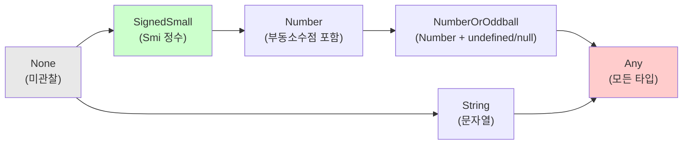

중요한 점은 **이 상태는 절대로 되돌아갈 수 없다** 는 것이다. 한번 `Number`로 진행했다면 다시 `SignedSmall`로 돌아가지 않는다.

왜 이렇게 설계했을까? 만약 피드백 상태가 왔다갔다 할 수 있다면, V8은 끝없는 최적화-취소 루프에 빠질 수 있다. 정수로 최적화 → 부동소수점 등장으로 취소 → 다시 정수만 와서 정수로 최적화 → 또 부동소수점... 이런 상황이 반복되면 자바스크립트를 실행하는 대신 최적화와 취소만 반복하게 된다. 단방향 래티스 구조는 이런 문제를 원천 차단한다[^11].

### 1-1-3-4. 디옵티마이제이션: 왜 최적화가 취소되는가

최적화 컴파일러는 실행 중 수집된 타입 정보를 기반으로 가정을 세우고 코드를 생성한다. 그런데 이 가정이 깨지면 어떻게 될까? 예를 들어, 지금까지 항상 정수만 받던 함수에 갑자기 문자열이 전달된다면?

이때 V8은 **디옵티마이제이션(Deoptimization)** 을 수행한다. 최적화된 기계어 코드의 실행을 중단하고, 해당 함수를 다시 바이트코드로 되돌려 Ignition에서 실행한다. 이 과정을 **bailout** 이라고도 부른다.

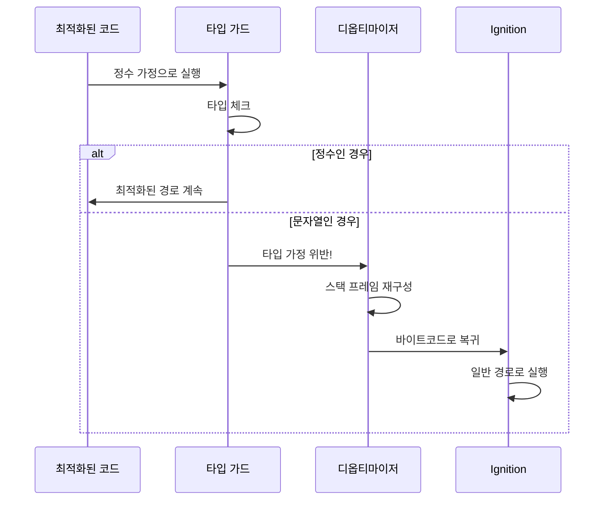

다음은 디옵티마이제이션을 유발하는 대표적인 예시다.

```javascript
function calculate(x) {
  return x * 2 + 1
}

// 처음에는 정수로만 호출
for (let i = 0; i < 10000; i++) {
  calculate(i)
}
// 이 시점에서 calculate는 정수에 최적화됨

// 갑자기 문자열 전달
calculate('hello') // 디옵티마이제이션 발생!
```

디옵티마이제이션이 발생하면 V8은 복잡한 작업을 수행해야 한다. 최적화된 코드의 스택 프레임을 해체하고, 현재 실행 지점에 해당하는 바이트코드 위치를 찾아내며, Ignition이 이해할 수 있는 형태로 스택을 재구성한다. 이 과정에서 CPU 캐시가 무효화되고, 새로운 코드 경로로의 분기가 발생하므로 상당한 비용이 든다.

디옵티마이제이션에도 종류가 있다. 각각이 언제 발생하는지 구체적인 상황과 함께 살펴보자[^11].

**Eager 디옵티마이제이션** 은 가장 흔한 유형으로, 최적화된 코드가 실행 중에 타입 가드를 만족하지 못할 때 **즉시** 발생한다. 위의 예시에서 `"hello"`가 전달되었을 때 발생하는 것이 이 유형이다. "지금 당장 문제가 생겼으니 바로 처리하자"는 방식이다.

**Lazy 디옵티마이제이션** 은 조금 더 미묘한 상황에서 발생한다. 최적화된 함수 A가 실행 중일 때, **다른 곳에서** 발생한 변경으로 인해 A의 가정이 무효화되는 경우다.

```javascript
function processUser(user) {
  return user.name.toUpperCase() // User.prototype.name이 문자열이라고 가정
}

// processUser가 최적화된 상태에서...
Object.prototype.name = 123 // 프로토타입 체인 변경!
// → processUser의 가정이 무효화됨 (Lazy 디옵티마이제이션)
```

**Soft 디옵티마이제이션** 은 V8이 "아직 판단하기 이르다"고 느낄 때 발생한다. 함수가 너무 일찍 최적화되어 충분한 타입 정보가 수집되지 않은 경우, V8은 최적화를 취소하고 더 많은 피드백을 수집한 후 다시 시도한다. 마치 "조금 더 지켜보고 결정하자"는 신중한 접근이다.

디옵티마이제이션은 성능에 부정적인 영향을 미친다. 최적화된 코드에서 인터프리터로 전환하는 비용도 있고, 이후 다시 최적화가 필요할 수도 있다. 따라서 **타입 일관성을 유지하는 것이 V8 성능 최적화의 핵심 원칙** 중 하나다.

Node.js에서 디옵티마이제이션 발생 여부와 이유를 확인하려면 V8 플래그를 사용할 수 있다. 다음 예제 코드(`examples/1-1/1-1-3-deopt-example.js`)로 실제 동작을 확인해보자.

```javascript
function calculate(x) {
  return x * 2 + 1
}

// 정수로 충분히 호출하여 최적화 유도
for (let i = 0; i < 10000; i++) {
  calculate(i)
}

console.log('--- 최적화 완료, 이제 문자열 전달 ---')

// 갑자기 문자열 전달 → 디옵티마이제이션 발생!
calculate('hello')
```

`--trace-opt --trace-deopt` 플래그로 실행하면 최적화와 디옵티마이제이션 과정을 모두 볼 수 있다.

```bash
node --trace-opt --trace-deopt examples/1-1/1-1-3-deopt-example.js
```

```
[marking 0x... <JSFunction calculate ...> for optimization to TURBOFAN, reason: hot and stable]
[compiling method 0x... <JSFunction calculate ...> (target TURBOFAN)]
[completed optimizing 0x... <JSFunction calculate ...> (target TURBOFAN)]
--- 최적화 완료, 이제 문자열 전달 ---
[bailout (kind: deopt-eager, reason: not a Smi): begin. deoptimizing 0x... <JSFunction calculate ...>]
```

출력을 해석하면 다음과 같다.

1. `marking ... for optimization to TURBOFAN, reason: hot and stable`: `calculate` 함수가 자주 호출되어 TurboFan 최적화 대상으로 선정됨
2. `completed optimizing`: 최적화 완료
3. `bailout (kind: deopt-eager, reason: not a Smi)`: 문자열 `'hello'`가 전달되자 "not a Smi(Small Integer가 아님)" 이유로 즉시(eager) 디옵티마이제이션 발생

`--trace-deopt`만 사용하면 디옵티마이제이션만, `--trace-opt`만 사용하면 최적화 과정만 볼 수 있다.

## 1-1-4. 인라인 캐싱의 원리

앞서 V8이 함수의 타입 정보를 기억하고 최적화한다는 것을 살펴보았다. 그런데 비슷한 문제가 **객체의 속성 접근** 에서도 발생한다. `obj.name`처럼 단순해 보이는 코드도, 동적 타입 언어에서는 의외로 복잡한 과정을 거쳐야 한다.

인라인 캐싱(Inline Caching, IC)은 바로 이 문제를 해결하기 위한 기법이다. V8 엔지니어들이 "자바스크립트를 빠르게 만드는 핵심 요소"라고 설명할 정도로 중요한 최적화 기법이다[^12]. 이 기법의 핵심 아이디어도 앞서 본 추측적 최적화와 같다. **"한 번 찾은 정보를 기억해두고 재사용하자."**

### 1-1-4-1. 왜 속성 접근이 느릴 수 있는가

자바스크립트에서 객체의 속성에 접근하는 것은 겉보기에 단순해 보인다.

```javascript
function getName(obj) {
  return obj.name
}
```

하지만 엔진 입장에서 `obj.name`을 실행하려면 여러 단계를 거쳐야 한다.

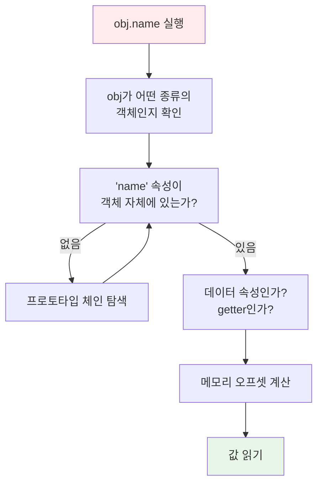

먼저 `obj`가 어떤 종류의 객체인지 확인해야 한다. 그다음 `name` 속성이 객체 자체에 있는지, 프로토타입 체인에 있는지 찾아야 한다. 속성을 찾았다면 그것이 데이터 속성인지, getter인지도 확인해야 한다. 마지막으로 속성의 실제 메모리 위치에서 값을 읽어와야 한다.

C++이나 Java 같은 정적 타입 언어에서는 객체의 구조가 컴파일 시점에 확정된다. 컴파일러는 `Person` 클래스의 `name` 필드가 객체 시작 주소에서 정확히 몇 바이트 떨어진 곳에 있는지 미리 알 수 있다. 따라서 `obj.name`은 단순히 "객체 시작 주소에서 N 바이트 오프셋의 값을 읽어라"라는 한두 개의 기계어 명령으로 변환된다.

```cpp
// C++에서의 속성 접근 (개념적)
// obj->name은 컴파일 시 다음과 같이 변환됨:
// mov eax, [obj + 8]  // 8은 name 필드의 오프셋
```

하지만 자바스크립트는 실행 시점까지 객체의 구조를 알 수 없다. `getName` 함수에 어떤 객체가 전달될지, 그 객체에 `name` 속성이 있는지, 있다면 어디에 저장되어 있는지 모른다. 매번 위의 복잡한 과정을 반복해야 한다면 성능이 크게 저하될 것이다.

인라인 캐싱은 이 문제를 "한 번 찾으면 기억해두자"는 아이디어로 해결한다. 핵심 통찰은 **실제 프로그램에서 같은 코드 위치에서는 대부분 비슷한 형태의 객체가 반복적으로 사용된다** 는 것이다. `getName` 함수가 User 객체와 함께 호출되었다면, 다음 호출에서도 User 객체일 가능성이 높다. 그렇다면 처음 한 번만 `name` 속성의 위치를 찾고, 그 정보를 캐싱해두면 이후 호출에서는 빠르게 접근할 수 있다.

### 1-1-4-2. 히든 클래스: 객체의 "설계도"

인라인 캐싱이 어떻게 동작하는지 이해하려면 먼저 V8이 객체를 어떻게 바라보는지 알아야 한다.

자바스크립트에서 객체는 매우 자유롭다. 너무 자유로운 나머지 런타임 입장에서는 귀찮을 정도다. 언제든 속성을 추가하거나 삭제할 수 있다. 하지만 실제 코드를 보면, 같은 "종류"의 객체가 반복적으로 생성되는 경우가 많다. V8은 이 점을 활용한다. **같은 구조를 가진 객체들은 "설계도"를 공유하게 만드는 것이다.** 이 설계도를 V8 내부에서는 **Map** 이라고 부르고, 다른 문헌에서는 **히든 클래스(Hidden Class)** 또는 **Shape** 라고 부른다.

```javascript
function Point(x, y) {
  this.x = x
  this.y = y
}

const p1 = new Point(1, 2)
const p2 = new Point(3, 4)
const p3 = new Point(5, 6)
```

위 코드에서 `p1`, `p2`, `p3`는 모두 같은 구조를 가진다. 셋 모두 `x`와 `y` 속성을 가지고, 같은 순서로 생성되었다. V8은 이런 객체들이 **같은 히든 클래스를 공유** 하도록 만든다.

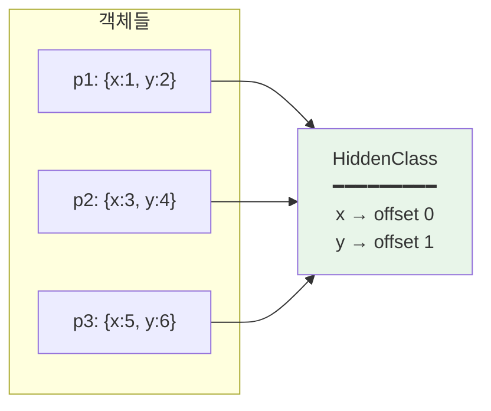

위 다이어그램은 세 객체 `p1`, `p2`, `p3`가 어떻게 하나의 히든 클래스를 공유하는지 보여준다. 각 객체는 자신만의 데이터(`x`, `y` 값)를 가지고 있지만, "이 객체의 구조가 어떻게 생겼는지"를 설명하는 메타데이터는 공유한다. Map 포인터가 모두 같은 HiddenClass를 가리키고 있음을 확인할 수 있다.

히든 클래스는 다음 정보를 포함한다[^13].

- **속성 이름**: 객체가 가진 속성들의 이름 목록
- **오프셋 정보**: 각 속성이 저장된 메모리 위치 (객체 시작 주소로부터의 상대 위치)
- **속성 특성**: writable, enumerable, configurable 등의 속성 디스크립터
- **프로토타입 참조**: 해당 객체의 프로토타입에 대한 포인터

같은 히든 클래스를 공유하는 객체들은 속성 접근 시 동일한 메모리 오프셋을 사용할 수 있다. `p1.x`나 `p2.x`나 `p3.x`나 모두 "객체 시작 주소 + 동일한 오프셋"에서 값을 읽으면 된다. 이것이 바로 히든 클래스의 핵심 가치다. **동적 타입 언어에서 정적 타입 언어와 유사한 최적화를 가능하게 해주는 것** 이다.

V8은 객체 내부에 히든 클래스에 대한 포인터를 저장한다. 속성에 접근할 때 V8은 먼저 이 포인터를 통해 히든 클래스를 참조하고, 히든 클래스에서 해당 속성의 오프셋을 조회한 다음, 그 오프셋을 사용해 실제 값을 읽는다.

### 1-1-4-3. 트랜지션 체인

히든 클래스는 객체의 "현재 구조"를 나타내지만, 자바스크립트에서는 객체에 언제든 속성을 추가할 수 있다. 그렇다면 속성이 추가될 때마다 히든 클래스는 어떻게 될까?

V8은 속성이 추가될 때마다 새로운 히든 클래스를 생성하고, 이전 히든 클래스에서 새 히든 클래스로의 "전환(transition)" 정보를 기록해둔다. 이렇게 연결된 히든 클래스들의 연쇄를 **트랜지션 체인(Transition Chain)** 이라고 부른다. 트랜지션 체인 덕분에 V8은 같은 패턴으로 생성되는 객체들이 히든 클래스를 재사용할 수 있게 된다.

```javascript
const obj = {} // HiddenClass 0: 빈 객체
obj.x = 1 // HiddenClass 1: {x}
obj.y = 2 // HiddenClass 2: {x, y}
```

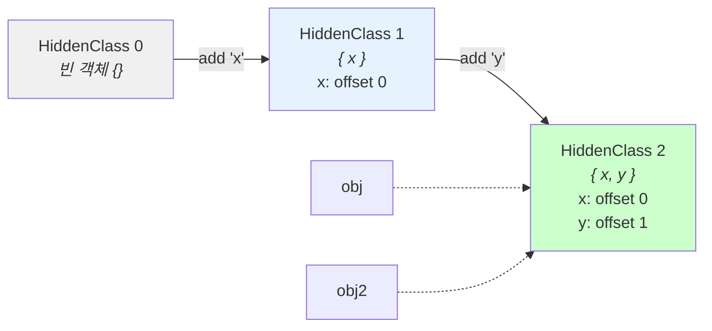

위 코드에서 빈 객체 `{}`는 HiddenClass 0을 가진다. `x` 속성이 추가되면 HiddenClass 1로 전환되고, `y` 속성이 추가되면 HiddenClass 2로 전환된다. 중요한 점은 이 전환이 **재사용 가능** 하다는 것이다.

```javascript
const obj2 = {} // HiddenClass 0
obj2.x = 10 // HiddenClass 1 (obj와 동일!)
obj2.y = 20 // HiddenClass 2 (obj와 동일!)
```

`obj2`도 같은 순서로 같은 속성을 추가하므로, 동일한 트랜지션 체인을 따라가며 결국 `obj`와 같은 최종 히든 클래스를 공유하게 된다.

그러나 속성 추가 순서가 다르면 전혀 다른 트랜지션 체인을 따라가게 된다.

```javascript
const obj3 = {} // HiddenClass 0
obj3.y = 30 // HiddenClass 1' (y를 먼저 추가!)
obj3.x = 40 // HiddenClass 2' (x, y와는 다른 히든 클래스)
```

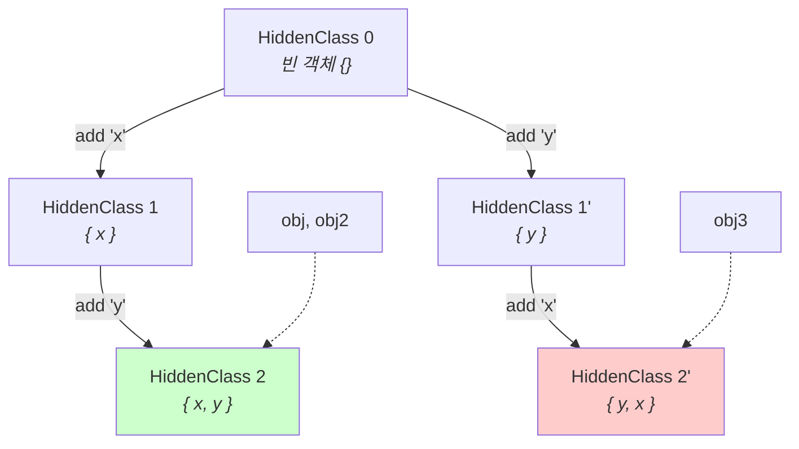

위 다이어그램에서 볼 수 있듯이, `obj3`는 `y`를 먼저 추가했기 때문에 완전히 다른 트랜지션 경로를 따라간다. 최종적으로 `obj3`는 `obj`, `obj2`와 다른 히든 클래스(HiddenClass 2')를 갖게 된다. **두 객체가 논리적으로 같은 속성을 가지고 있더라도, 속성 추가 순서가 다르면 서로 다른 히든 클래스를 갖는다.** 이는 성능에 직접적인 영향을 미치는데, 인라인 캐시가 다형(polymorphic) 상태로 전환되기 때문이다.

### 1-1-4-4. IC의 상태 변화: 단형에서 거대형까지

인라인 캐시는 코드의 각 속성 접근 위치마다 생성된다. 그리고 실행 중에 어떤 종류의 객체를 만나느냐에 따라 상태가 변화한다. 이 상태는 성능에 직접적인 영향을 미치므로 이해해둘 필요가 있다[^14].

IC의 상태는 크게 네 단계로 나뉜다. 처음에는 아무것도 관찰하지 않은 **Uninitialized** 상태에서 시작한다. 첫 번째 객체를 만나면 **Monomorphic(단형)** 상태가 되어 가장 빠른 성능을 낸다. 이후 다른 형태의 객체를 만나면 **Polymorphic(다형)** 상태로 전환되고, 너무 많은 형태를 만나면 최적화를 포기하는 **Megamorphic(거대형)** 상태가 된다.

아래 다이어그램은 이 상태 전이 과정을 보여준다. 한번 Megamorphic 상태에 도달하면 다시 돌아갈 수 없다는 점에 주목해야 한다.

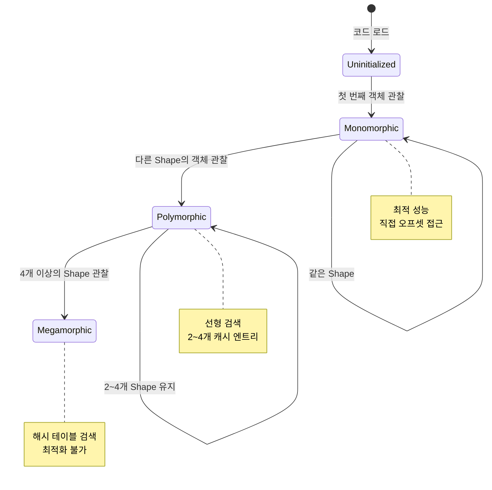

이제 각 상태를 자세히 살펴보자.

**Uninitialized (초기화되지 않음)**

코드가 처음 실행되기 전의 상태다. 아직 어떤 객체도 보지 못했다.

**Monomorphic (단형)**

하나의 히든 클래스만 관찰한 상태다. 이 상태에서 인라인 캐시는 가장 효율적으로 동작한다. 캐시에 저장된 히든 클래스와 현재 객체의 히든 클래스가 일치하면, 저장된 오프셋으로 바로 접근할 수 있다.

```javascript
function getX(point) {
  return point.x // IC: Point 히든 클래스 → 오프셋 0
}

getX(new Point(1, 2)) // IC가 Point의 히든 클래스를 학습
getX(new Point(3, 4)) // 캐시 히트! 빠른 접근
getX(new Point(5, 6)) // 캐시 히트! 빠른 접근
```

**Polymorphic (다형)**

2개 이상의 히든 클래스를 관찰했지만, 아직 관리 가능한 수준인 상태다. V8은 여러 히든 클래스와 해당 오프셋을 배열로 캐싱한다.

```javascript
function getX(obj) {
  return obj.x
}

getX({ x: 1 }) // 히든 클래스 A
getX({ x: 2, y: 3 }) // 히든 클래스 B
getX({ x: 4, y: 5, z: 6 }) // 히든 클래스 C
// IC는 이제 A, B, C 세 가지를 캐싱
```

다형 상태에서는 속성 접근 시 캐시된 히든 클래스들을 순차적으로 비교해야 하므로 단형보다 느리다.

**Megamorphic (거대형)**

너무 많은 히든 클래스를 관찰하여 개별 추적을 포기한 상태다. V8에서는 일반적으로 4개를 초과하는 히든 클래스를 보면 megamorphic 상태로 전환된다. 이 상태에서는 인라인 캐싱(IC)의 이점을 잃게 되며, 경우에 따라 객체 자체가 **딕셔너리 모드(Dictionary Mode)** 로 전환되어 전역 해시 테이블을 사용한 일반적인 속성 검색을 수행하게 된다. 이는 오프셋을 통한 직접 접근보다 훨씬 느리다.

다음 표는 IC 상태별 성능 특성을 정리한 것이다.

| 상태        | 캐시된 타입 수 | 성능 | 최적화 컴파일러 영향 |
| ----------- | -------------- | ---- | -------------------- |
| Monomorphic | 1              | 최고 | 완전한 인라이닝 가능 |
| Polymorphic | 2~4            | 중간 | 제한적 인라이닝      |
| Megamorphic | 5+             | 낮음 | 인라이닝 불가        |

### 1-1-4-5. 인라인 캐싱이 무효화되는 패턴

일부 코딩 패턴은 인라인 캐싱을 무력화시켜 성능을 저하시킨다. 다음은 대표적인 안티패턴들이다.

첫째, **객체 생성 순서의 불일치** 다.

```javascript
// 안 좋은 예: 속성 추가 순서가 다름
function createUser1(name, age) {
  const user = {}
  user.name = name
  user.age = age
  return user
}

function createUser2(name, age) {
  const user = {}
  user.age = age // 순서가 다름!
  user.name = name
  return user
}

const u1 = createUser1('Alice', 30)
const u2 = createUser2('Bob', 25)
// u1과 u2는 다른 히든 클래스를 가짐
```

둘째, **동적 속성 추가** 다.

```javascript
// 안 좋은 예: 조건에 따라 다른 속성 추가
function createProduct(data) {
  const product = { name: data.name }
  if (data.price) {
    product.price = data.price
  }
  if (data.discount) {
    product.discount = data.discount // 히든 클래스 분기 발생
  }
  return product
}
```

셋째, **delete 연산자 사용** 이다.

```javascript
// 안 좋은 예: delete로 속성 삭제
const obj = { x: 1, y: 2, z: 3 }
delete obj.y // 히든 클래스가 "느린 모드"로 전환될 수 있음
```

`delete` 연산자는 객체를 "딕셔너리 모드"로 전환시킬 수 있다. 딕셔너리 모드에서는 히든 클래스 기반 최적화가 적용되지 않아 속성 접근이 느려진다.

위 세 가지 패턴이 실제로 히든 클래스 분기를 발생시키는지 V8 네이티브 함수를 통해 직접 확인할 수 있다. `%HaveSameMap()` 함수는 두 객체가 같은 히든 클래스를 공유하는지 반환한다.

```bash
node --allow-natives-syntax examples/1-1/1-1-4-ic-invalidation.js
```

```
============================================================
패턴 1: 객체 생성 순서 불일치
============================================================
user1: name → age 순서로 생성
user2: name → age 순서로 생성 (user1과 동일)
user3: age → name 순서로 생성 (순서 다름!)

user1과 user2가 같은 Map 공유: true ← 예상: true
user1과 user3가 같은 Map 공유: false ← 예상: false

============================================================
패턴 2: 동적 속성 추가
============================================================
p1: { name, price }
p2: { name, price, discount }
p3: { name }

p1과 p2가 같은 Map 공유: false ← 예상: false (속성 개수 다름)
p1과 p3가 같은 Map 공유: false ← 예상: false (속성 개수 다름)

============================================================
패턴 3: delete 연산자
============================================================
obj1: { x: 1, y: 2, z: 3 }
obj2: { x: 4, y: 5, z: 6 }

delete 전 - obj1과 obj2가 같은 Map 공유: true ← 예상: true

delete obj2.y 실행 후...

delete 후 - obj1과 obj2가 같은 Map 공유: false ← 예상: false
```

출력 결과를 보면 세 가지 패턴 모두 예상대로 히든 클래스 분기를 발생시킨다. 같은 속성을 가진 객체라도 생성 순서가 다르면 다른 히든 클래스를 갖고, 조건에 따라 속성이 추가되면 각기 다른 히든 클래스가 만들어지며, `delete` 연산 후에는 원래 같은 히든 클래스를 공유하던 객체들이 더 이상 공유하지 않게 된다.

## 1-1-5. V8 최적화를 고려한 코드 작성법

지금까지 살펴본 V8의 동작 원리를 바탕으로, 실제 Node.js 코드를 작성할 때 적용할 수 있는 최적화 원칙들을 정리한다. 여기서 소개하는 원칙들은 마이크로 최적화 수준의 기법이므로, 먼저 알고리즘과 데이터 구조 수준의 최적화를 검토한 후에 적용해야 한다. 프로파일링을 통해 실제 병목 지점을 확인한 후에 적용하는 것이 바람직하다.

### 1-1-5-1. 객체 형태를 일관되게 유지하기

같은 종류의 객체는 항상 같은 구조로 생성해야 한다. 속성의 이름과 추가 순서를 일관되게 유지하면 히든 클래스가 공유되어 인라인 캐싱이 효과적으로 동작한다.

```javascript
// 좋은 예: 클래스나 팩토리 함수로 일관된 구조 보장
class User {
  constructor(name, age, email) {
    this.name = name
    this.age = age
    this.email = email
  }
}

// 모든 User 인스턴스가 동일한 히든 클래스를 공유
const users = [
  new User('Alice', 30, 'alice@example.com'),
  new User('Bob', 25, 'bob@example.com'),
  new User('Charlie', 35, 'charlie@example.com'),
]
```

속성이 선택적인 경우에도 `undefined`나 `null`로 초기화하여 구조를 일관되게 유지하는 것이 좋다.

```javascript
// 좋은 예: 선택적 속성도 미리 초기화
class Product {
  constructor(name, price, discount = null) {
    this.name = name
    this.price = price
    this.discount = discount // 항상 존재
  }
}
```

### 1-1-5-2. 함수 인자 타입의 일관성

함수를 호출할 때 항상 같은 타입의 인자를 전달하면 TurboFan이 해당 타입에 특화된 최적화 코드를 생성할 수 있다.

```javascript
// 안 좋은 예: 다양한 타입으로 호출
function process(value) {
  return value * 2
}

process(10) // 숫자
process('hello') // 문자열 → 디옵티마이제이션 유발
process([1, 2, 3]) // 배열 → 또 다른 디옵티마이제이션
```

```javascript
// 좋은 예: 타입별로 함수 분리
function processNumber(value) {
  return value * 2
}

function processString(value) {
  return value.repeat(2)
}

// 각 함수는 특정 타입에 최적화됨
```

### 1-1-5-3. 배열 요소 타입의 일관성

V8은 배열 요소의 타입에 따라 다른 내부 표현을 사용한다[^13]. 정수만 담긴 배열(PACKED_SMI_ELEMENTS), 실수를 포함한 배열(PACKED_DOUBLE_ELEMENTS), 객체를 포함한 배열(PACKED_ELEMENTS) 등이 구분된다.

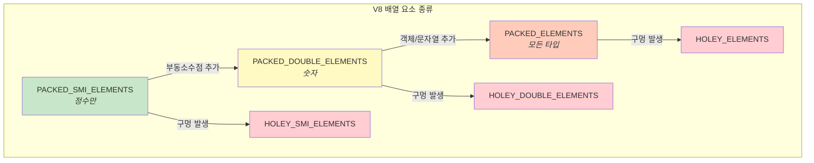

```javascript
// 안 좋은 예: 타입이 섞인 배열
const mixed = [1, 2.5, 'three', { four: 4 }]

// 좋은 예: 동일한 타입의 요소
const numbers = [1, 2, 3, 4, 5] // PACKED_SMI_ELEMENTS
const floats = [1.1, 2.2, 3.3, 4.4, 5.5] // PACKED_DOUBLE_ELEMENTS
```

> **심화: 포인터 태깅(Pointer Tagging)과 Smi**
>
> V8은 왜 정수(Smi, Small Integer)를 별도로 취급할까? 이는 메모리 효율성 때문이다. V8은 메모리 주소(포인터)와 데이터 값을 구분하기 위해 **포인터 태깅** 이라는 기법을 사용한다. 32비트(혹은 64비트) 워드의 하위 1비트를 태그로 사용하여, 0이면 정수(Smi), 1이면 포인터로 해석하는 식이다.
>
> 이 때문에 32비트 시스템에서 Smi는 31비트 정수 범위를 가지며, 64비트 시스템에서는 32비트 범위를 가진다. 이 범위를 벗어나는 큰 정수는 힙 메모리에 별도 객체(`HeapNumber`)로 할당되어야 하므로, Smi보다 메모리를 더 차지하고 접근 속도도 느리다. 배열에 정수만 유지하면 V8은 이 값들을 효율적인 Smi 형태로 연속 저장할 수 있다.

중요한 점은 **배열의 요소 종류는 한 번 "강등"되면 되돌릴 수 없다** 는 것이다. `PACKED_SMI_ELEMENTS` 배열에 부동소수점을 추가하면 `PACKED_DOUBLE_ELEMENTS`가 되고, 다시 정수만 남겨도 원래 상태로 돌아가지 않는다.

또한 배열에 "구멍(hole)"이 생기지 않도록 주의해야 한다. 구멍이 있는 배열(HOLEY)은 요소 접근 시 프로토타입 체인 확인이 필요해 느려진다.

왜 프로토타입 체인을 확인해야 할까? 구멍이 있는 배열에서 `arr[i]`를 읽을 때, V8은 두 가지 상황을 구분해야 한다. 해당 인덱스에 `undefined`가 명시적으로 저장된 것인지, 아니면 한 번도 값이 할당된 적 없는 빈 슬롯(구멍)인지를 판단해야 한다. 후자의 경우 자바스크립트 명세에 따라 프로토타입 체인을 따라 올라가며 해당 인덱스의 값을 검색해야 한다.

```javascript
Array.prototype[2] = '프로토타입에서 찾음'

const holey = [1, 2, , 4, 5] // 인덱스 2가 구멍
console.log(holey[2]) // '프로토타입에서 찾음' - 프로토타입 체인 검색!

const packed = [1, 2, undefined, 4, 5] // 인덱스 2에 undefined가 명시적으로 저장됨
console.log(packed[2]) // undefined - 프로토타입 체인 검색 불필요
```

PACKED 배열은 모든 인덱스에 값이 있다고 보장되므로 프로토타입 체인 확인 없이 바로 값을 반환할 수 있다. 하지만 HOLEY 배열은 매번 "이 인덱스가 구멍인가?"를 확인하고, 구멍이면 프로토타입 체인을 검색해야 하므로 오버헤드가 발생한다.

```javascript
// 안 좋은 예: 구멍이 있는 배열
const sparse = []
sparse[1000] = 1 // 희소 배열 - 인덱스 0~999가 모두 구멍

// 좋은 예: 연속된 배열
const packed = [1, 2, 3, 4, 5]

// 배열 생성 시 주의
const arr = new Array(100) // HOLEY 배열 생성! 100개의 구멍이 있는 배열
const arr2 = [] // 빈 배열로 시작해서 push로 채우는 것이 나음
for (let i = 0; i < 100; i++) {
  arr2.push(i)
}
```

`new Array(100)`은 길이가 100인 배열을 생성하지만, 모든 인덱스가 구멍인 HOLEY 배열이 된다. 반면 빈 배열에서 시작해 `push`로 요소를 채우면 PACKED 배열이 유지된다. 성능이 중요한 경우 후자의 방식을 사용하는 것이 좋다.

### 1-1-5-4. try-catch와 최적화

과거 V8의 Crankshaft 최적화 컴파일러는 `try-catch` 블록이 포함된 함수 전체를 최적화하지 못했다[^15]. 그래서 개발자들은 `try-catch`를 별도의 작은 함수로 분리하는 패턴을 사용하기도 했다. 하지만 TurboFan이 도입된 V8 5.9(Node.js 8.3+)부터는 이 제한이 해결되어 `try-catch`가 포함된 코드도 정상적으로 최적화된다[^16]. 다만 에러가 빈번하게 발생하는 코드 경로는 여전히 최적화에 불리하다.

```javascript
// 에러를 제어 흐름으로 사용하는 것은 피해야 함
function parseJSON(str) {
  try {
    return JSON.parse(str)
  } catch (e) {
    return null // 에러가 자주 발생하면 성능 저하
  }
}

// 더 나은 방식: 사전 검증
function parseJSON(str) {
  if (typeof str !== 'string' || str.trim() === '') {
    return null
  }
  try {
    return JSON.parse(str)
  } catch (e) {
    return null // 예외적인 경우에만 발생
  }
}
```

첫 번째 방식은 유효하지 않은 JSON 문자열이 자주 들어오면 매번 예외가 발생한다. 예외 처리는 **스택 되감기(stack unwinding)** 등 비용이 큰 작업을 수반하므로, 빈번한 예외는 성능에 악영향을 미친다. 스택 되감기란 예외가 발생했을 때 현재 함수에서 시작해 호출 스택을 거슬러 올라가며 적절한 `catch` 블록을 찾고, 그 과정에서 각 스택 프레임의 지역 변수를 정리하는 작업이다. 함수 호출이 깊이 중첩되어 있을수록 이 비용은 커진다. 두 번째 방식처럼 명백히 잘못된 입력은 사전에 걸러내고, `try-catch`는 정말 예외적인 상황에만 사용하는 것이 좋다.

### 1-1-5-5. 동적 키 관리에는 Object 대신 Map 사용하기

앞서 언급했듯이 객체에 속성을 동적으로 추가하거나 삭제하면 히든 클래스가 계속 변경되거나, 객체가 '딕셔너리 모드'로 전환되어 성능이 저하될 수 있다.

만약 키-값 쌍을 자주 추가/삭제해야 하거나, 키가 런타임에 동적으로 결정되는 경우라면 일반 객체(Object) 대신 **`Map`** 을 사용하는 것이 좋다. `Map`은 히든 클래스 메커니즘에 의존하지 않고 해시 테이블 기반으로 동작하도록 설계되어 있어, 빈번한 변경에도 안정적인 성능을 보장한다. 또한 객체를 포함한 모든 타입을 키로 사용할 수 있다는 장점도 있다.

## 1-1-6. Node.js와 V8

지금까지 V8 엔진의 내부 동작을 살펴보았다. 이제 Node.js 환경에서 V8이 어떤 역할을 하는지, 그리고 Node.js의 다른 구성 요소들과 어떻게 협력하는지 알아보자.

### 1-1-6-1. Node.js 아키텍처에서 V8의 위치

2009년, 라이언 달(Ryan Dahl)은 V8 엔진을 브라우저 밖으로 꺼내어 서버 사이드에서 자바스크립트를 실행할 수 있는 런타임을 만들었다. 이것이 Node.js의 탄생이다. 라이언 달이 V8을 선택한 이유는 명확했다. 당시 V8은 다른 자바스크립트 엔진들을 압도하는 성능을 보여주고 있었고, 독립적으로 임베딩하기에 적합한 구조를 가지고 있었다.

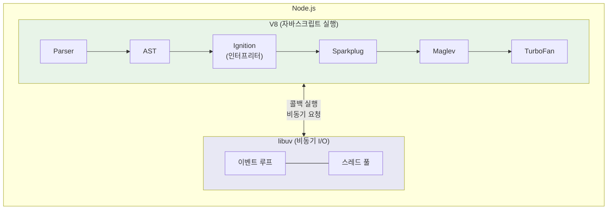

Node.js는 크게 두 핵심 엔진으로 구성된다. **V8** 은 자바스크립트 코드의 파싱, 컴파일, 실행을 담당하고, **libuv** 는 비동기 I/O와 이벤트 루프를 담당한다. `fs.readFile`이나 `setTimeout` 같은 비동기 API를 호출하면 V8이 해당 요청을 libuv에 전달하고, libuv가 작업을 완료하면 콜백 함수가 다시 V8에서 실행된다. libuv에 대해서는 다음 장에서 자세히 다룬다.

### 1-1-6-2. V8과 libuv의 협업

Node.js 아키텍처에서 V8은 자바스크립트 코드의 파싱, 컴파일, 실행을 전담한다. Node.js가 비동기 I/O로 유명하지만, V8 자체는 비동기와 전혀 관련이 없다. V8은 순수하게 자바스크립트 코드를 기계어로 변환하고 실행하는 역할에만 집중한다. 비동기 I/O, 이벤트 루프, 네트워크 처리 등은 libuv라는 별도의 라이브러리가 담당한다. 즉, Node.js는 V8(자바스크립트 실행)과 libuv(비동기 I/O)를 결합한 런타임인 것이다.

Node.js 애플리케이션이 실행되면 다음과 같은 과정을 거친다. 먼저 V8이 자바스크립트 소스 코드를 파싱하여 추상 구문 트리(AST)를 생성한다. 이 AST는 바이트코드로 컴파일되어 Ignition 인터프리터에서 실행된다. 실행 중에 V8은 각 함수가 얼마나 자주 호출되는지, 어떤 타입의 값들이 전달되는지를 추적한다. 특정 함수가 충분히 "뜨거워지면" TurboFan 최적화 컴파일러가 해당 함수를 고도로 최적화된 기계어 코드로 다시 컴파일한다.

이 과정에서 중요한 점은 V8이 Node.js의 비동기 모델과 독립적으로 동작한다는 것이다. V8은 동기적으로 코드를 실행하며, 비동기 작업의 스케줄링은 libuv가 담당한다. `setTimeout`이나 `fs.readFile` 같은 비동기 API를 호출하면, V8은 해당 함수 호출을 완료하고 즉시 반환한다. 실제 I/O 작업은 libuv가 처리하고, 작업이 완료되면 콜백 함수가 다시 V8에 의해 실행된다.

```javascript
const fs = require('fs')

console.log('1. 파일 읽기 시작')

fs.readFile('data.txt', (err, data) => {
  // 이 콜백은 나중에 V8에 의해 실행된다
  console.log('3. 파일 읽기 완료')
})

console.log('2. 파일 읽기 요청 후')
```

위 코드에서 V8의 역할을 자세히 살펴보자. V8은 첫 번째 `console.log`를 실행한다. 그다음 `fs.readFile`을 만나면, V8은 이 함수 호출을 처리하고 libuv에게 파일 읽기 작업을 요청한다. V8은 기다리지 않고 즉시 두 번째 `console.log`를 실행한다. 나중에 파일 읽기가 완료되면 libuv가 이벤트 루프를 통해 콜백을 큐에 넣고, V8이 해당 콜백을 실행한다. 이처럼 V8은 "자바스크립트 코드 실행"이라는 핵심 임무에만 집중하고, 나머지는 Node.js의 다른 구성 요소들이 처리한다.

### 1-1-6-3. 마이크로태스크와 매크로태스크

여기서 한 가지 더 깊이 이해해야 할 점이 있다. `fs.readFile`이나 `setTimeout`과 같은 비동기 작업은 libuv가 관리하는 태스크 큐(Macrotask Queue)를 사용하지만, **Promise** 와 `process.nextTick` 같은 작업은 **V8이 직접 관리하는 마이크로태스크(Microtask) 큐** 를 사용한다. 마이크로태스크는 일반 태스크보다 우선순위가 높아, 현재 실행 중인 코드가 끝나자마자(콜 스택이 비워지자마자) 즉시 실행된다.

### 1-1-6-4. V8의 멀티스레드 활용

또한, "자바스크립트는 싱글 스레드"라는 말은 실행 컨텍스트(Main Thread)에 국한된 이야기다. **V8 엔진 자체는 멀티 스레드를 적극적으로 활용한다.** Ignition 인터프리터가 메인 스레드에서 코드를 실행하는 동안, TurboFan의 최적화 컴파일 작업이나 가비지 컬렉션(Garbage Collection) 작업은 **백그라운드 스레드** 에서 병렬로 수행된다. 덕분에 V8은 무거운 최적화 작업 중에도 메인 스레드의 멈춤(Jank) 현상을 최소화할 수 있다.

### 1-1-6-5. Node.js와 V8 버전

Node.js에서 V8의 버전은 매우 중요하다. Node.js의 각 메이저 버전은 특정 V8 버전과 연결되어 있으며, V8 업데이트에 따라 새로운 자바스크립트 문법 지원, 성능 개선, 보안 패치 등이 이루어진다. Node.js 24.x는 V8 13.6 버전을 사용하며, 이는 최신 ECMAScript 기능들과 최신 최적화 기법들을 지원한다.

## 1-1-7. 마치며

이 장에서는 V8 엔진의 핵심 동작 원리를 살펴보았다. V8이 어떻게 자바스크립트 코드를 파싱하고, 바이트코드로 컴파일하며, 런타임에 수집한 타입 정보를 활용하여 최적화된 기계어 코드를 생성하는지 알아보았다. 이 과정을 한 문장으로 요약하면, **V8은 "추측하고 검증하는" 최적화 전략을 사용한다** 고 할 수 있다.

참고로 이 장에서는 컴파일과 실행 파이프라인에 집중했지만, V8 성능의 또 다른 핵심 축은 **메모리 관리와 가비지 컬렉션(GC)** 이다. V8은 Orinoco라는 엔진을 통해 세대별 가비지 컬렉션(Generational GC)을 수행하며, 이 과정 역시 백그라운드 스레드에서 병렬로 처리되어 성능을 최적화한다.

핵심 내용을 정리하면 다음과 같다.

**컴파일 파이프라인**: V8은 Ignition 인터프리터로 빠르게 실행을 시작하고, 코드가 "핫" 상태가 되면 Maglev와 TurboFan으로 점진적으로 최적화한다. 각 계층은 컴파일 속도와 생성 코드 품질 사이의 트레이드오프를 대표한다.

**타입 피드백과 추측적 최적화**: V8은 실행 중에 피드백 벡터를 통해 타입 정보를 수집하고, 이를 기반으로 특정 타입에 특화된 최적화 코드를 생성한다. 이 가정이 깨지면 디옵티마이제이션이 발생한다.

**히든 클래스와 인라인 캐싱**: 히든 클래스는 동적 객체에 정적 타입 언어와 유사한 구조를 부여하고, 인라인 캐싱은 속성 접근 비용을 최소화한다. 단형(monomorphic) 상태를 유지하는 것이 최적의 성능을 얻는 핵심이다.

V8 최적화의 핵심 원칙은 **"일관성"** 이다. 객체 구조의 일관성, 함수 인자 타입의 일관성, 배열 요소 타입의 일관성을 유지하면 V8은 더 효과적으로 코드를 최적화할 수 있다. 반대로 타입이 불규칙하게 변하거나 객체 구조가 동적으로 바뀌면, V8은 최적화를 포기하거나 이미 적용된 최적화를 취소(디옵티마이제이션)해야 한다.

그러나 이러한 최적화 기법에 대한 이해가 "조기 최적화"의 함정에 빠지게 해서는 안 된다. 대부분의 경우 가독성과 유지보수성을 우선시하고, 프로파일링을 통해 실제 병목 지점을 확인한 후에 최적화를 적용해야 한다. V8은 이미 대부분의 일반적인 자바스크립트 코드를 매우 빠르게 실행한다. 이 장에서 다룬 내용은 성능에 민감한 핫 패스(hot path)에서 마지막 몇 퍼센트의 성능을 짜낼 때, 또는 왜 특정 코드 패턴이 예상보다 느린지 디버깅할 때 유용하다.

다음 장에서는 Node.js의 또 다른 핵심 구성 요소인 libuv와 비동기 I/O 시스템을 살펴본다. V8이 자바스크립트 코드 실행을 담당한다면, libuv는 Node.js가 논블로킹 I/O를 수행할 수 있게 해주는 기반이다. V8과 libuv의 협업을 이해하면 Node.js가 싱글 스레드임에도 높은 동시성을 달성하는 비밀을 알 수 있다.

---

[^1]: Celebrating 10 years of V8 - <https://v8.dev/blog/10-years>

[^2]: AST Explorer - <https://astexplorer.net/>

[^3]: Blazingly fast parsing, part 2: lazy parsing - <https://v8.dev/blog/preparser>

[^4]: Firing up the Ignition interpreter - <https://v8.dev/blog/ignition-interpreter>

[^5]: Understanding V8's Bytecode - <https://medium.com/nicotec/understanding-v8s-bytecode-317d46c94775>

[^6]: Ignition Design Doc - <https://docs.google.com/document/d/11T2CRex9hXxoJwbYqVQ32yIPMh0uouUZLdyrtmMoL44>

[^7]: Maglev - V8's Fastest Optimizing JIT - <https://v8.dev/blog/maglev>

[^8]: Digging into the TurboFan JIT - <https://v8.dev/blog/turbofan-jit>

[^9]: V8 release v7.1 - Escape Analysis improvements - <https://v8.dev/blog/v8-release-71>

[^10]: V8 source code: flag-definitions.h - <https://github.com/v8/v8/blob/main/src/flags/flag-definitions.h>

[^11]: An Introduction to Speculative Optimization in V8 - <https://benediktmeurer.de/2017/12/13/an-introduction-to-speculative-optimization-in-v8/>

[^12]: JavaScript engine fundamentals: Shapes and Inline Caches - <https://mathiasbynens.be/notes/shapes-ics>

[^13]: Fast properties in V8 - <https://v8.dev/blog/fast-properties>

[^14]: What's up with monomorphism? - <https://mrale.ph/blog/2015/01/11/whats-up-with-monomorphism.html>

[^15]: V8: Behind the Scenes (November Edition) - <https://benediktmeurer.de/2016/11/25/v8-behind-the-scenes-november-edition/>

[^16]: Launching Ignition and TurboFan - <https://v8.dev/blog/launching-ignition-and-turbofan>
